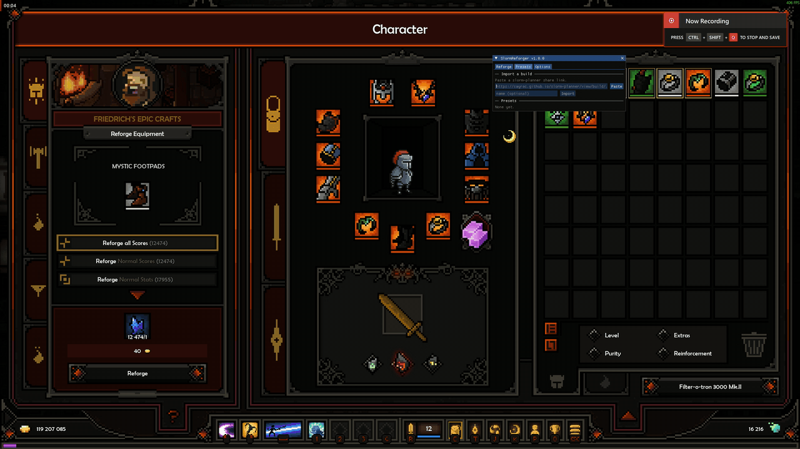
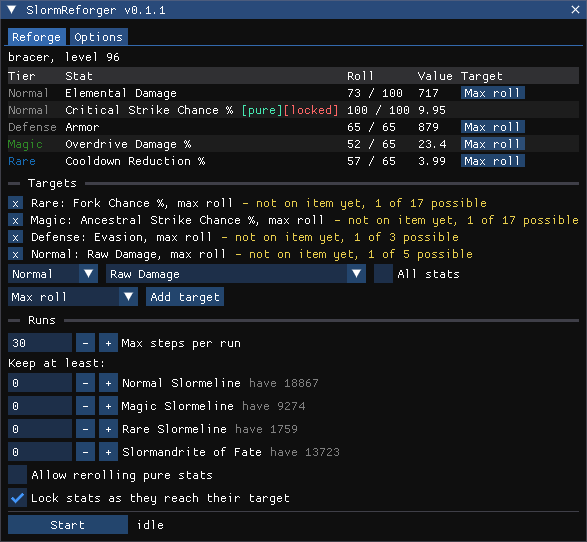
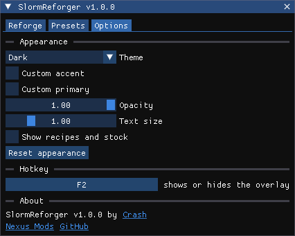

# SlormReforger

Automatic reforging at Friedrich's blacksmith in [The Slormancer](https://store.steampowered.com/app/1104280/The_Slormancer/).

SlormReforger adds a window to the reforge panel where you pick the stats and rolls you want. Press Start and it rerolls until the item has them, then stops.

It works through the game's own reforge recipes and pays their normal costs. It does not edit items, rolls, or save.



## Features

- **Targets per tier.** Choose a stat and a goal: have the stat at any roll, max roll, at least a given value, or at least a given roll.
- **The game's real stat pools.** The stat list is the game's own "Possible Outcomes" for that item and tier, so you can only pick what can actually roll. Stats already on the item are tagged.
- **Auto-lock.** Optionally locks each target stat as soon as it is met and unlocks one that still needs a better roll, so several targets in one tier are found one at a time.
- **Auto-add.** Optionally applies the game's Add Magic, Rare and Epic recipes when a target's tier is not on the item yet.
- **Material reserves.** Set how many of each material to keep. A run stops before it would go below that.
- **Careful by default.** It refuses targets that cannot be reached, leaves pure stats alone unless you allow it, stops if you close the panel, and has a step limit per run.
- **Run log.** Every reroll and lock is listed, with the goldus spent at the end.
- **Options.** Four themes, custom colors, opacity, text size and a rebindable hotkey.



## Install

Requires The Slormancer on Steam (Windows, 64-bit) and the [Microsoft Visual C++ 2015-2022 Redistributable (x64)](https://aka.ms/vs/17/release/vc_redist.x64.exe).

1. Back up your save folder: `%LocalAppData%\The_Slormancer`
2. Download the latest zip from [Releases](https://github.com/wistb/SlormReforger/releases).
3. Open the game folder. In Steam: right-click the game, Manage, Browse local files.
4. Extract the entire zip there, so `version.dll` and the `mods` folder sit next to `The Slormancer.exe`.
5. Start the game from Steam as usual.

The game's own files are not changed, so a game update does not undo the install.

To uninstall, delete `version.dll`, `SlormReforger-README.txt`, `aurie.log` and the `mods` folder from the game folder.

## Use

1. Talk to Friedrich, open Reforge Equipment and put an item in the slot. The SlormReforger window appears.
2. Under Targets, pick a tier, a stat and a goal, then press Add target. The Max roll button beside a stat on the item adds that target in one click.
3. Under Runs, set the step limit and how much of each material to keep.
4. Press Start. Press Stop, or close the panel, to end a run early.

F6 hides and shows the window. The key can be changed on the Options tab.

Each target shows where it stands: green when met, yellow while there is work to do, red when reforging cannot get there.



## How it works

The Slormancer is a GameMaker game. The mod is a plugin for [YYToolkit](https://github.com/AurieFramework/YYToolkit), which runs on the [Aurie Framework](https://github.com/AurieFramework/Aurie) and gives native code access to the game's scripts. SlormReforger reads the item in the reforge slot, asks the game which stats each tier can roll, and calls the game's own apply script for each reroll, lock and unlock. The window is drawn with [Dear ImGui](https://github.com/ocornut/imgui).

The release zip also contains a small `version.dll`. Windows loads it from the game folder in place of the system file of the same name. It passes every call through to the real one and starts Aurie when the game starts, so the game's exe never has to be patched.

## Building

Needs Windows with the Visual Studio 2022 Build Tools (C++ workload). The build script runs from WSL.

```sh
./build.sh           # build bin/SlormReforger.dll and bin/version.dll
./build.sh deploy    # build, then copy the mod into the game's mods/Aurie
./build.sh package   # build, then write dist/SlormReforger-v<version>.zip
```

- `deploy` needs the game folder: export `SLORM_GAME`, or put `SLORM_GAME="..."` in a file named `.env`.
- `package` downloads the pinned Aurie and YYToolkit builds and checks each against a SHA-256 before adding it to the zip.

Without WSL, build `SlormReforger.vcxproj` and `proxy/Proxy.vcxproj` with MSBuild, configuration `Release`, platform `x64`.

Where the vendored sources come from is listed in [THIRD-PARTY.md](THIRD-PARTY.md).

## License

[AGPL-3.0](LICENSE). The mod is built against Aurie and YYToolkit, which are AGPL-3.0, and the release zip includes their official builds.

## Credits

Aurie Framework and YYToolkit by the AurieFramework team. Dear ImGui by Omar Cornut. Stat data cross-checked against [slorm-planner](https://github.com/cayrac/slorm-planner) and [slormancer-api](https://github.com/cayrac/slormancer-api) by cayrac, and [SlormBuilder](https://github.com/Senryoku/SlormBuilder) by Senryoku.
